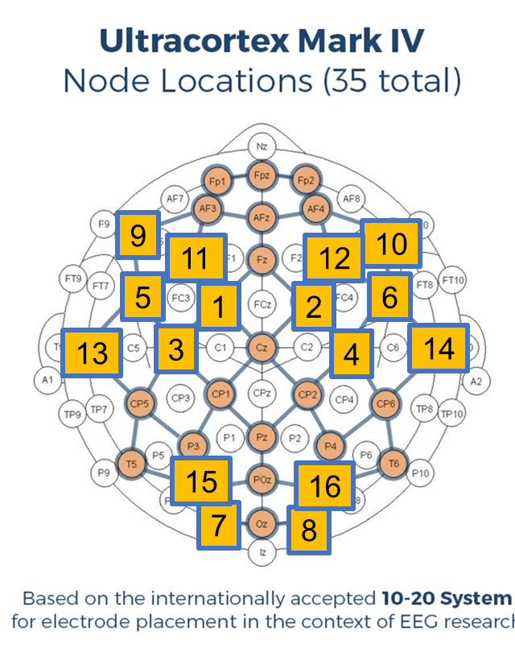

# Laryngeal and Motor Imagery (and SSVEP) with the OpenBCI Cyton+Daisy Mark IV Headset
This repository is code for running an experiment with an OpenBCI 16-channel Mark IV headset. Three BCI control mechanisms are used:
- SSVEP
- motor imagery
- laryngeal imagery

The idea is to test the OpenBCI headset's ability to perform classic control mechanisms (SSVEP and motor imagery), and try a new control paradigm (laryngeal imagery). With laryngeal imagery, the idea is to imagining humming a sound in order to control the BCI. Either different pitches can be used for different control selections, or humming vs no humming can be used.

## Conda environment
The conda environment file is contained in openbci.yml. To install the environment, use `conda env create -f openbci.yml`.

## Code files
`brainflow_test_wifi.py` - can be used to test connection and data collection from OpenBCI headset with a wifi connection
`brainflow_test_bluetooth.py` - can be used to test connection and data collection from OpenBCI headset with a bluetooth connection
`make_video.py` - creates SSVEP videos
`data_collection.py` - code for running the experiment and collection data

## Protocol for collecting data

Our sensors were located as follows:
| Sensor | 10-20 Location |
|--------|----------------|
| 1      | FC1            |
| 2      | FC2            |
| 3      | C3             |
| 4      | C4             |
| 5      | FC5            |
| 6      | FC6            |
| 7      | O1             |
| 8      | O2             |
| 9      | F7             |
| 10     | F8             |
| 11     | F3             |
| 12     | F4             |
| 13     | T3             |
| 14     | T4             |
| 15     | PO3            |
| 16     | PO4            |

A diagram is shown below:

- First, try to use a freshly-charged battery.
- Next, put on the headset and use the OpenBCI GUI to ensure the sensors are connected well. This can be done by live streaming the data and checking the impedences for the sensors (clicking on the 'Ohm' buttons for the channels). A reading of less than 500kOhm is sufficient, although lower is better. For higher-quality headsets with wet sensors, 50kOhm is the max recommended. You should be able to clearly see signals in the display.
- Turn off the impedence measurement, and use the spectrogram to see if alpha waves can be detected. Choose the channels from the occipital lobe (e.g. O3, O4, PO3, PO4) and check that alpha waves appear around 10 Hz when closing your eyes. This should appear as a band of intensity in the spectrogram.
- An example of alpha waves are shown below:

- Run the experiment data collection file, with `python ___` or by first running `ipython`, then running the file with `run ___`.

## Analyzing data
